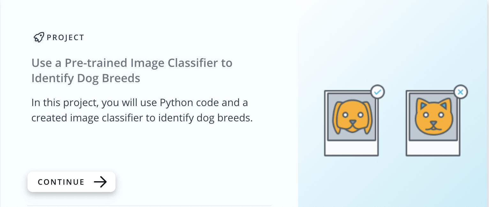

# Use a Pre-Trained Image Classifier to Identify Dog Breeds

>
## Project goal
The project goal was to improve our programming skills in Python utilising a *created* image classifier to identify dog breeds. The image classifier used a deep learning model called a **convolutional neural network** (CNN). The CNN had already learnt the features relevant to the identification of dogs from a dataset of 1.2 million images, [ImageNet](https://image-net.org/). The main focus of the project was on Python and not on the actual classifier.

Project: Use a Pre-trained Image Classifier to Identify Dog Breeds
Project Overview
In this project, you will build a model capable of recognizing dog breeds using a pre-trained image classifier. You will learn how to load a pre-trained model, process images, and classify dogs based on their features. Additionally, you can extend the project to include other types of images, such as human faces or different animal species.

Project Steps
1. Load the Dataset
You will use a dataset containing images of various dog breeds, along with additional test images.

2. Use a Pre-trained Model
Instead of training a model from scratch, you will use a pre-trained deep learning model

3. Process the Images
Resize images to match the input requirements of the model
Convert images into numerical arrays
Normalize pixel values to fit the pre-trained model’s format
4. Test and Evaluate the Model
Pass images through the model and check the classification accuracy
Analyze and improve the model’s predictions if necessary
5. Improve the Model (Optional)
Experiment with different pre-trained models
Tune hyperparameters for better performance
Use data augmentation techniques to enhance the dataset